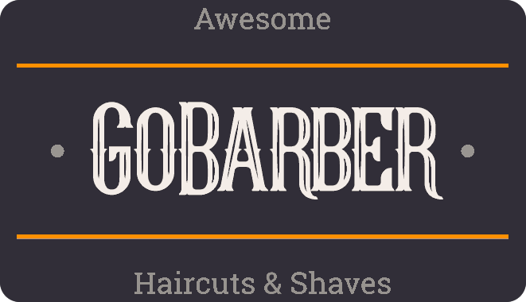

<!--
*** Thanks for checking out this README Template. If you have a suggestion that would
*** make this better, please fork the repo and create a pull request or simply open
*** an issue with the tag "enhancement".
*** Thanks again! Now go create something AMAZING! :D
-->

<!-- PROJECT SHIELDS -->
<!--
*** I'm using markdown "reference style" links for readability.
*** Reference links are enclosed in brackets [ ] instead of parentheses ( ).
*** See the bottom of this document for the declaration of the reference variables
*** for contributors-url, forks-url, etc. This is an optional, concise syntax you may use.
*** https://www.markdownguide.org/basic-syntax/#reference-style-links
-->

[![Contributors][contributors-shield]][contributors-url]
[![Forks][forks-shield]][forks-url]
[![Stargazers][stars-shield]][stars-url]
[![Issues][issues-shield]][issues-url]
[![LinkedIn][linkedin-shield]][linkedin-url]

<!-- PROJECT LOGO -->
<br />
<p align="center">
  <a href="https://github.com/CaioQuirinoMedeiros/go-barber-2.0">
      
  </a>

  <h3 align="center">Go Barber</h3>

  <p align="center">
    An awesome scheduling app for barbers
  </p>

  <p align="center">
    ~~~~~~~~~~ <a href="https://drive.google.com/uc?export=download&id=16GFqFha8em4vvAYSKLqBesBWI5YaI6nG" target="_blank">App</a> ~~~~~~~~~~
  </p>

  <p align="center">
    ~~~~~~~~~~ <a href="https://caioquirinomedeiros.github.io/go-barber-2.0" target="_blank">Web</a> ~~~~~~~~~~
  </p>
</p>

<!-- TABLE OF CONTENTS -->

## Table of Contents

- [About the Project](#about-the-project)
- [Built With](#built-with)
- [Installation](#installation)
- [Contributing](#contributing)
- [Acknowledgements](#acknowledgements)

<!-- ABOUT THE PROJECT -->

## About The Project

<div align="justify-between" style="display:flex;justify-content:space-between">
  
  
</div>
<br />

<br />
<br />

This project is the main project built on [Rocketseat's GoStack bootcamp](https://rocketseat.com.br/). I finished its course on June 2020 but still keep on track of learning and improving my skills with some projects over the time. Altough it's a course project, I always take some different decisions and make my own improvements (that's the right way to learn by the way).

This project consists of an appointment schedule app for barbers (you can think of any service provider though). In the app the user can register, log in, see the list of providers and schedule an appointment at an available day and time. in the web version, on the other hand, the user can see the schedules booked with him.

### Built With

The better stack I've ever known (actually it's the only stack I have experience)

- [NodeJS](https://nodejs.org/en/)
- [ReactJS](https://reactjs.org/)
- [ReactNative](https://reactnative.dev/)

## Installation

To make the whole magic happen you need to run the Node API and the frontends pointing to the API. If you are familiar with Node an React you shouldn't have trouble to do that, but here are the main steps:

### API

- cd into api project

```sh
cd go_barber_2_api
```

- Make sure you have [Node](https://nodejs.org/en/download/) and [Yarn](https://classic.yarnpkg.com/en/docs/install/#windows-stable) installed.

- Install the dependencies

```sh
yarn install
```

- Use the `.env.example` to set the environment variables needed (you can just make a copy of that file and name it `.env`)

  - Here you will see that you need connection with **_postgresql_**, **_mongodb_** and **_redis_**. I recommend you use [Docker](https://www.docker.com/) to do that, but it's up to you.
  - Note that if you set **_sendgrid_** as `MAIL_DRIVER` you'll need an [Sendgrid API Key](https://signup.sendgrid.com/)
  - If you set **_ses_** as `MAIL_PROVIDER` or **_s3_** as `STORAGE_PROVIDER` you'll also need AWS Credentials

- Once you have the postgresql database setup, run the migrations:

```sh
yarn migrate
```

- Finally, run the Node server in development mode and you are good to go (you'll get an error if your database conections are not setup correctly)

```sh
yarn dev
```

## APP

- cd into app project

```sh
cd go_barber_2_app
```

- Make sure you have [ReactNative](https://reactnative.dev/docs/environment-setup) environment setted up (ReactNative CLI).

- Install the dependencies

```sh
yarn install
```

- Open the `src/services/api.ts` file and set the correct API url on axios instance (it's probably **_<http://localhost:3333>_**)

- You may need to reverse port 8081 for metro bundler work correctly. You may need to reverse port 3333 to allow your app connect with the api. And you may need to reverse port 8097 if you are going to use Flipper to debug. So I made it simple:

```sh
yarn adb-reverse
```

- Set an environment variable called `ENVFILE` with the value of your `.env` file and then build the project. Okay, I've leave a script for that, but it might not work depending on your OS, in this case, search how to proper set an environment variable on your OS

```sh
yarn android
```

- Run the Metro Bundler server if it has not started automatically

```sh
yarn start
```

## WEB

- No need to tell you to cd into the web project at this point

- Install the dependencies

```sh
yarn install
```

- Once again, use the `.env.example` to set the API url

- Just run it:

```sh
yarn start
```

## Contributing

Feel free to contribute on this project **(and leave a star!!)**

1. Fork the Project
2. Create your Feature Branch (`git checkout -b feature/AmazingFeature`)
3. Commit your Changes (`git commit -m 'Add some AmazingFeature'`)
4. Push to the Branch (`git push origin feature/AmazingFeature`)
5. Open a Pull Request

6. Create an issue

## Acknowledgements

- [express](https://github.com/expressjs/express)
- [TypeORM](https://github.com/typeorm/typeorm)
- [handlebars](https://github.com/handlebars-lang/handlebars.js)
- [date-fns](https://github.com/date-fns/date-fns)
- [multer](https://github.com/expressjs/multer)
- [ts-node](https://github.com/TypeStrong/ts-node)
- [unform](https://github.com/Rocketseat/unform)
- [axios](https://github.com/axios/axios)
- [react-native-action-sheet](https://github.com/beefe/react-native-actionsheet)
- [react-native-config](https://github.com/luggit/react-native-config)
- [react-native-image-crop-picker](https://github.com/ivpusic/react-native-image-crop-picker)
- [react-native-permissions](https://github.com/zoontek/react-native-permissions)
- [react-native-vector-icons](https://github.com/oblador/react-native-vector-icons)
- [styled-components](https://github.com/styled-components/styled-components)
- [react-day-picker](https://github.com/gpbl/react-day-picker)
- [react-spring](https://github.com/pmndrs/react-spring)
- [yup](https://github.com/jquense/yup)

---

<span>
  
</span>
<a href="https://github.com/CaioQuirinoMedeiros" target="_blank">
  
</a>
<a href="https://www.linkedin.com/in/caio-quirino-medeiros/" target="_blank">
  
</a>
<a href="mailto:caio.quirino.medeiros@gmail.com" target="_blank">
  
</a>
<a href="https://app.rocketseat.com.br/me/caio-medeiros-1562947679" target="_blank">
  
</a>

---
---

[][1]
[][2]
[][3]
[][4]

---

<!-- MARKDOWN LINKS & IMAGES -->
<!-- https://www.markdownguide.org/basic-syntax/#reference-style-links -->

[contributors-shield]: https://img.shields.io/github/contributors/CaioQuirinoMedeiros/go-barber-2.0.svg?style=flat-square
[contributors-url]: https://github.com/CaioQuirinoMedeiros/go-barber-2.0/graphs/contributors
[forks-shield]: https://img.shields.io/github/forks/CaioQuirinoMedeiros/go-barber-2.0.svg?style=flat-square
[forks-url]: https://github.com/CaioQuirinoMedeiros/go-barber-2.0/network/members
[stars-shield]: https://img.shields.io/github/stars/CaioQuirinoMedeiros/go-barber-2.0.svg?style=flat-square
[stars-url]: https://github.com/CaioQuirinoMedeiros/go-barber-2.0/stargazers
[issues-shield]: https://img.shields.io/github/issues/CaioQuirinoMedeiros/go-barber-2.0.svg?style=flat-square
[issues-url]: https://github.com/CaioQuirinoMedeiros/go-barber-2.0/issues
[linkedin-shield]: https://img.shields.io/badge/-LinkedIn-black.svg?style=flat-square&logo=linkedin&colorB=555
[linkedin-url]: https://www.linkedin.com/in/caio-quirino-0a916812a/
[1]: https://github.com/CaioQuirinoMedeiros
[2]: https://www.linkedin.com/in/caio-quirino-medeiros/
[3]: mailto:caio.quirino.medeiros@gmail.com
[4]: https://app.rocketseat.com.br/me/caio-medeiros-1562947679